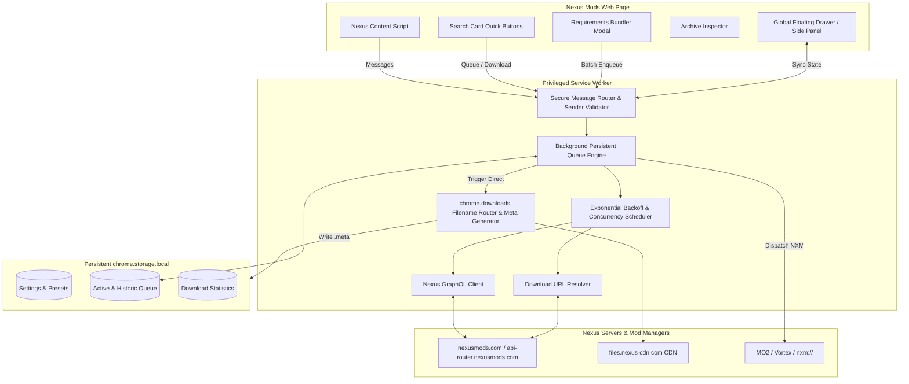

# The Definitive Nexus Mods Download Tool: Architectural Blueprint & Strategic Roadmap

> **Target Platforms**: Chromium (Chrome, Edge, Brave, Opera) & Mozilla Firefox (MV3)  
> **Status**: Approved Strategy & Implementation Blueprint  

---

## 1. Executive Summary & Value Proposition

To establish **Nexus Mods Download Tools (NXDT)** as the undisputed, definitive downloading tool for the Nexus Mods ecosystem, NXDT addresses the major pain points that users, power modders, and collection curators face daily:

```
┌─────────────────────────────────────────────────────────────────────────────────────────────┐
│                                 THE DEFINITIVE NXDT SUITE                                   │
├──────────────────────────────┬──────────────────────────────┬───────────────────────────────┤
│  ⚡ Zero-Friction Browsing   │  📦 Resilient Bulk Engine    │  🛠️ Mod Manager Harmony       │
│  • Instant 1-Click Downloads │  • Persistent Background S.W.│  • Structured Subfolders      │
│  • Search Card Quick Buttons │  • 1-5 Slot Adaptive Concurr.│  • MO2 .meta File Generation  │
│  • Smart Requirement Bundler │  • Exponential Backoff (429) │  • NXM Direct Protocol Bridge │
│  • Inline Archive Inspector  │  • Global Floating Drawer UI │  • Firefox & Chrome MV3 Parity│
└──────────────────────────────┴──────────────────────────────┴───────────────────────────────┘
```

---

## 2. Core Pillars of the Definitive Suite

### Pillar 1: Persistent Background Queue Engine & Global Floating Drawer
* **Background Service Worker Ownership**: All queue state, downloads, retries, and pacing move from the in-page DOM to `src/background/queue-manager.js`, backed by `chrome.storage.local`.
* **Tab-Independent Execution**: Users can start a 100-mod collection download and freely navigate away, switch games, or close tabs without terminating or corrupting the queue.
* **Global Floating Drawer UI**: A slide-out HUD accessible across any Nexus Mods page (and browser side panel) showing:
  * Real-time download progress, current speed, elapsed/remaining time.
  * Active concurrency slots with individual item progress.
  * Queue controls: **Pause**, **Resume**, **Skip**, **Retry Failed**, **Clear**, and **Export URL List**.
  * Audio chime / desktop notification on completion or when manual intervention (e.g. Cloudflare / offsite link) is needed.
* **Adaptive Concurrency & Backoff**:
  * Free-tier mode: 1-2 concurrent slots with safety pauses to avoid Cloudflare tripping.
  * Premium-tier mode: 3-5 concurrent parallel downloads.
  * Auto-recovery: Automatic exponential backoff on HTTP 429 (Rate Limit) and 502/503/504 errors.

---

### Pillar 2: Smart Requirements Bundler & Dependency Tree Resolver
* **"Download Mod + All Requirements" Button**: Injected directly onto mod file cards and headers.
* **Prerequisite Tree Parsing**: Scrapes and queries GraphQL for mod requirements, categorizing them into:
  1. *Nexus Mods Prerequisite Files* (can be queued automatically).
  2. *Optional / Recommended Addons*.
  3. *External / Off-Site Dependencies* (e.g., SKSE, Script Hook V, GitHub releases, LoversLab, Discord).
* **Interactive Dependency Modal**: Displays a checklist of requirements with file sizes, versions, and direct 1-click batch queueing.
* **External Link Assistant**: For off-site dependencies, opens cleanly organized cards with copyable links, installation notes, and MD5 hashes.

---

### Pillar 3: In-Page Ergonomics, Search Quick-Actions & Archive Inspector
* **Search & Browse Card Injections**: Injects 1-click **Main File (NXM)** and **Main File (Manual)** quick-download buttons onto all mod cards across `/mods`, `/explore`, and search listings.
* **Inline Archive Inspector**: Hovering or clicking an inspector badge on any file card fetches the archive file tree (via Nexus GraphQL file manifest) without requiring a full page reload or manual download to check if it contains a `fomod/` folder, `Data/` structure, or conflicting DLLs.
* **Zero-Countdown Automation (Enhanced)**: Instant slow-download bypass, skip requirements redirect, auto-fire download, and configurable tab close.

---

### Pillar 4: Intelligent File Organization & Mod Manager (MO2/Vortex) Harmony
* **Smart Subfolder Routing (`chrome.downloads.onDeterminingFilename`)**:
  * Instead of dumping `.7z` and `.zip` files into the root `Downloads` folder, automatically sorts downloads into:
    `Downloads/NexusMods/[GameName]/[ModName] - [Version]/[FileName]`
  * Configurable path templates in Settings (e.g., `{game}/{mod_name}/{file_name}`).
* **MO2 `.meta` File Generation**:
  * Automatically generates paired `.meta` / `meta.ini` files alongside downloaded archives containing `modID`, `fileID`, `version`, and `gameDomain` so archives can be dropped straight into MO2's download directory with complete metadata tracking intact.
* **Robust NXM Scheme Routing**: Clean dispatch for Vortex, MO2, and Wabbajack with configurable URL protocols.

---

### Pillar 5: Cross-Browser Dual-Target Build Pipeline (Chrome MV3 + Firefox MV3)
* **Universal WebExtension Polyfill Layer**: Clean abstraction over `chrome.*` and `browser.*` APIs.
* **Automated Dual-Target Builds**:
  * `npm run build:chrome` $\rightarrow$ `dist/chrome` (Chromium MV3 manifest, service worker background).
  * `npm run build:firefox` $\rightarrow$ `dist/firefox` (Firefox MV3 manifest, background event scripts).
  * `npm run build` $\rightarrow$ Builds and validates both simultaneously.
* **Cross-Browser Verification**: Automated tests validating manifests, permissions, and script references for both distributions.

---

### Pillar 6: Nexus Native Dark Glass Design System & Preset Profiles
* **Modern Aesthetic**: Dark graphite (`#1a1c1f`, `#24282e`) with Nexus amber accents (`#da8e35`, `#f59e0b`), frosted glass blur backdrop, crisp typography, and fluid micro-animations.
* **Settings Quick Presets**:
  * 🚀 **Fast Solo Modder**: Instant 1-click download, auto-close tab, auto-start slow countdown, skip warning modals.
  * 📦 **Collection Hoarder**: Persistent background queue, 3-slot concurrency, auto-retry on 429, desktop notifications.
  * 🛡️ **Cautious Free-Tier**: Serial 1-by-1 queue with gentle 3s pacing, Cloudflare detection safeguard, structured subfolders.
  * 🛠️ **MO2 Power User**: Force NXM manager routing, generate `.meta` files, custom download folder categorization.

---

## 3. Architecture & Data Flow Diagram



---

## 4. Phased Implementation Roadmap

| Phase | Core Objective | Key Deliverables |
|---|---|---|
| **Phase 1: Persistent Background Queue & Floating Drawer** | Decouple queue from tab DOM to service worker | Background queue engine, storage sync, floating drawer UI, pause/resume/clear/retry |
| **Phase 2: Adaptive Concurrency & Error Backoff** | High-throughput resilient downloads | 1-5 parallel download slots, exponential backoff on HTTP 429/50x, external requirement resolver |
| **Phase 3: Smart Requirements Bundler & Search Actions** | Transform normal mod browsing | "Download Mod + Requirements" bundle modal, search card 1-click buttons, inline archive inspector |
| **Phase 4: Intelligent File Sorting & MO2 Meta Generator** | Mod manager workflow harmony | `onDeterminingFilename` subfolder sorting, MO2 `.meta` generator, NXM protocol enhancements |
| **Phase 5: Firefox MV3 Support & Dual Build Pipeline** | Cross-browser distribution | Browser abstraction layer, `build:firefox` & `build:chrome`, AMO packaging, full test suite |
| **Phase 6: UI Polish & Preset Configuration Profiles** | Ultimate visual & UX excellence | Nexus dark glass theme, 4 1-click Presets, live search in Settings, comprehensive documentation |
